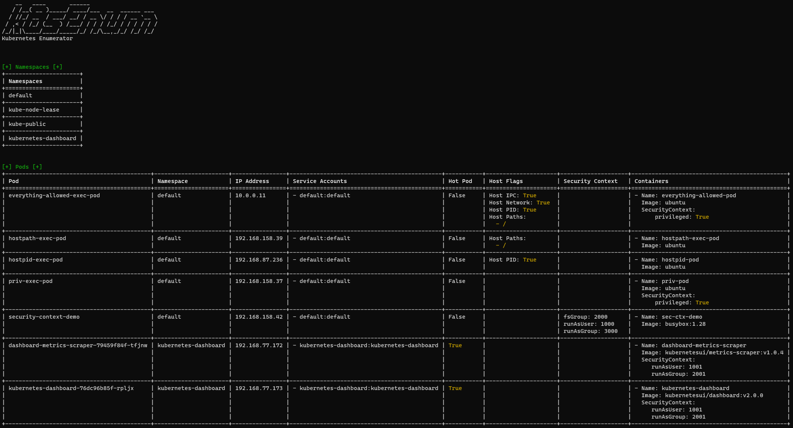

# k8sEnum
The kubernetes enumerator **k8sEnum** can help to get a quick overview of resources deployed to a Kubernetes cluster and to identify insecure configurations, high privileged service accounts, etc.



## Installation
Until a release is available on pypi, **k8sEnum** can be installed locally by running `python setup.py install` in the root folder of the project.

## Usage
### Enumerate all
```
k8sEnum all
```

### Enumerate specific resources (e.g. only Pods and secrets)
```
k8sEnum pods secrets
```

### Filter results
#### By namespace
Results can be filtered by namespaces. This filter only applies to types which are bound to a namespace.

```
k8sEnum -en default -en kube-system all
```

#### By role prefix
Results can also be filtered by a role prefix. Predefined roles like `system:controller:certificate-controller` with the prefix `system:` could e.g. be excluded with `k8sEnum -er system: all`.

## Extension
In order to create a new enumeration plugin, at least the following steps are required:

1. Create a new module with a class `MyEnumerator` which extends `BaseEnum` and thus have the methods `enumerate(..)` and `create_rows(..)`.
2. Create a function `enumerate(enum_client, ...)` within the module (see other modules for an example).
2. Register the Enumerator in `loader.py`.


